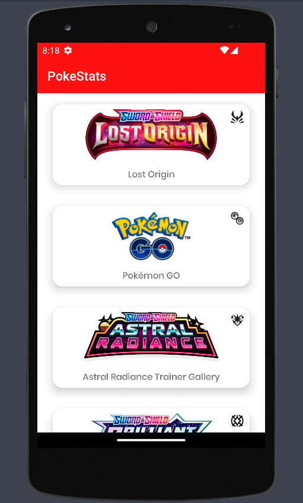
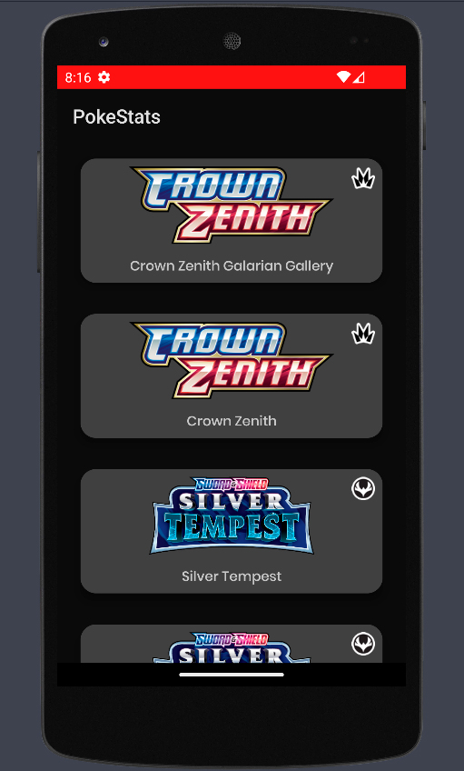
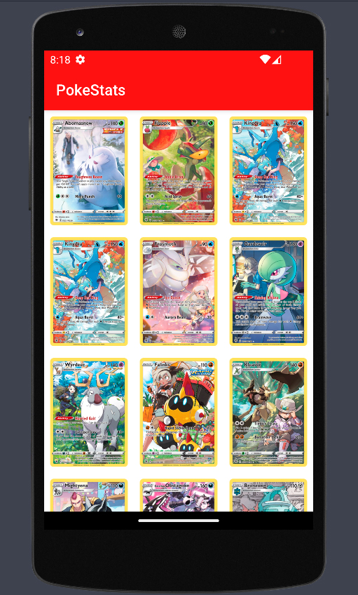
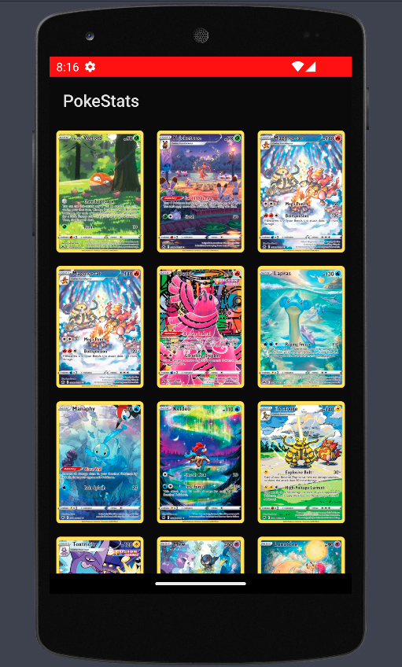
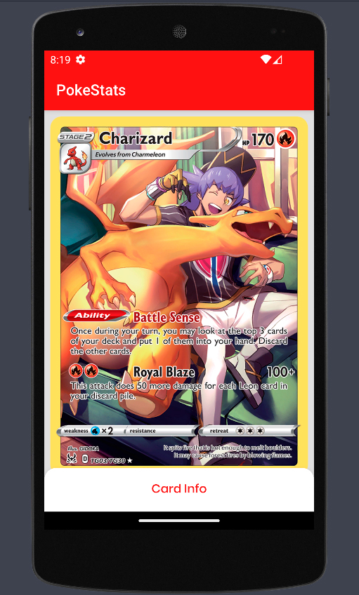
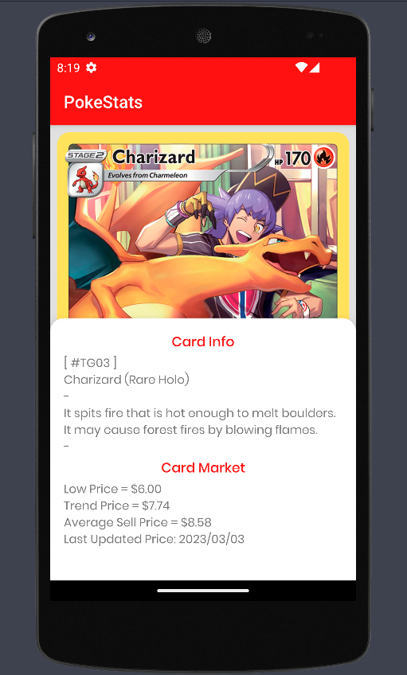
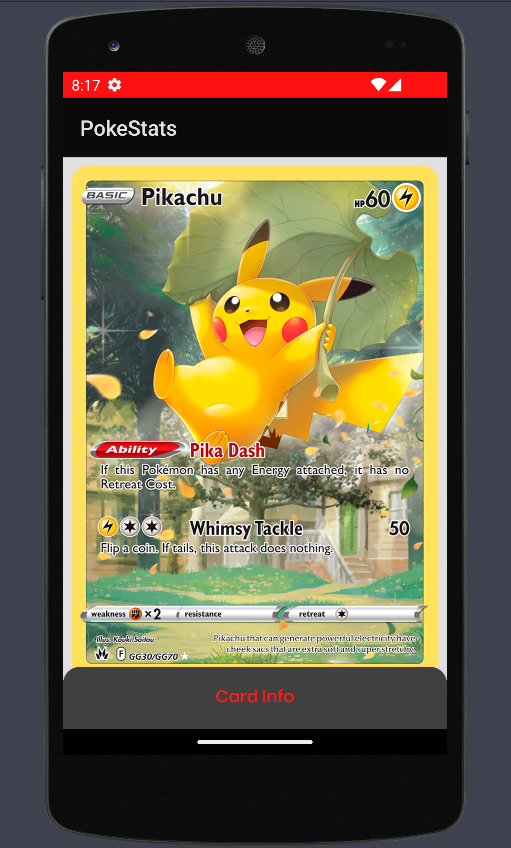
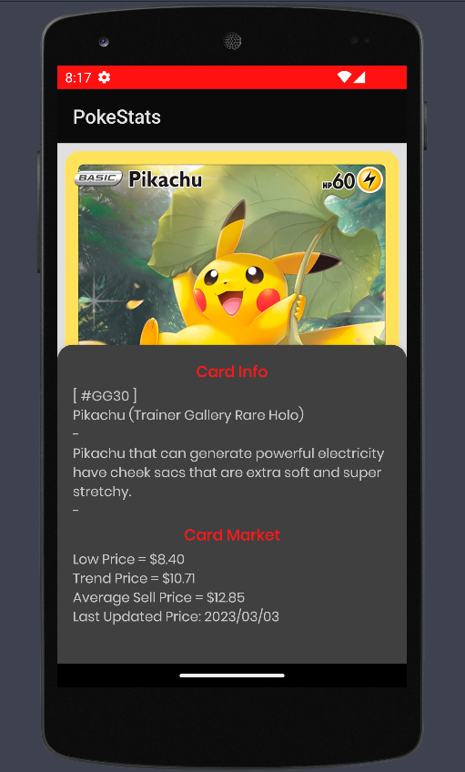

# 
📱 Mobile Application

## 
🌌 _[Quathar][Q] & [Rakioth][R]_ 💊

[Q]: https://github.com/Quathar
[R]: https://github.com/Rakioth
---
This is an Android Mobile Application of PokemonTCG (Trading Card Game).

In this application you can search for the sets and their respective cards available in the [pokemontcg.io](https://pokemontcg.io/) API.

API manipulation is done via [Retrofit](https://square.github.io/retrofit/).

# 
🌆 Views

The application contains 3 different views.
In the sets view you can search the sets of cards you are interested in, once you touch one set you will be in the cards view, where you can see all the cards of that set and finally, if you touch a card, you will see the card graphics and a brief information about it.

All the app views are shown below with light and dark themes.

## 
🗃️ Sets View

    
    

## 
🃏 Cards View

    
    

## 
📖 Card Details View

    
    
    
    

